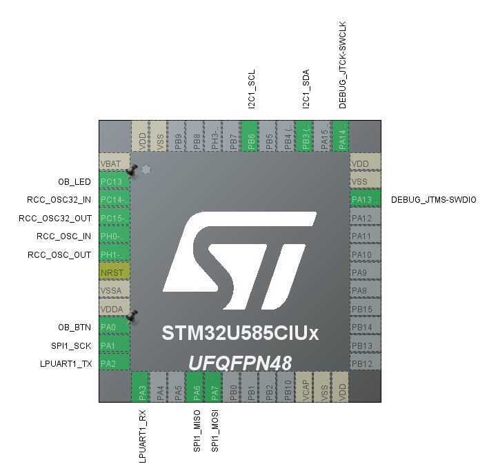

# STM32U585CIU6 評価F/W開発

## 開発環境

- マイコン: STM32U585CIU6
  - CPU: ARM Cortex-M33
  - FPU: 単精度FPU
  - Clock: 160MHz
  - Flash: 2MB
  - SRAM: 768KB
- OS
  - FreeRTOS (CMSIS RTOS 2)
- コンパイラ: Clang (`st-arm-clang 19.1.6`) 
  - 最適化: debug
- ツールチェイン
  - CMake
  - STM32CubeMX
  - STM32CubeIDE (VSCode版)
- デバッグ
  - デバッガ: `ST-LINK/V2-1`
    - デバッグI/F: SWD
  - printf()デバッグ
    - LPUART
      - TX: PA2ピン
      - RX: PA3ピン
      - 921600bps 8N1

## メモリ使用量

```shell
[build] Memory region         Used Size  Region Size  %age Used
[build]              RAM:       13800 B       768 KB      1.75%
[build]              ROM:       33688 B         2 MB      1.61%
[build]            SRAM4:          0 GB        16 KB      0.00%
[build]          BK_SRAM:           4 B         2 KB      0.20%
```

## ピンアサイン


